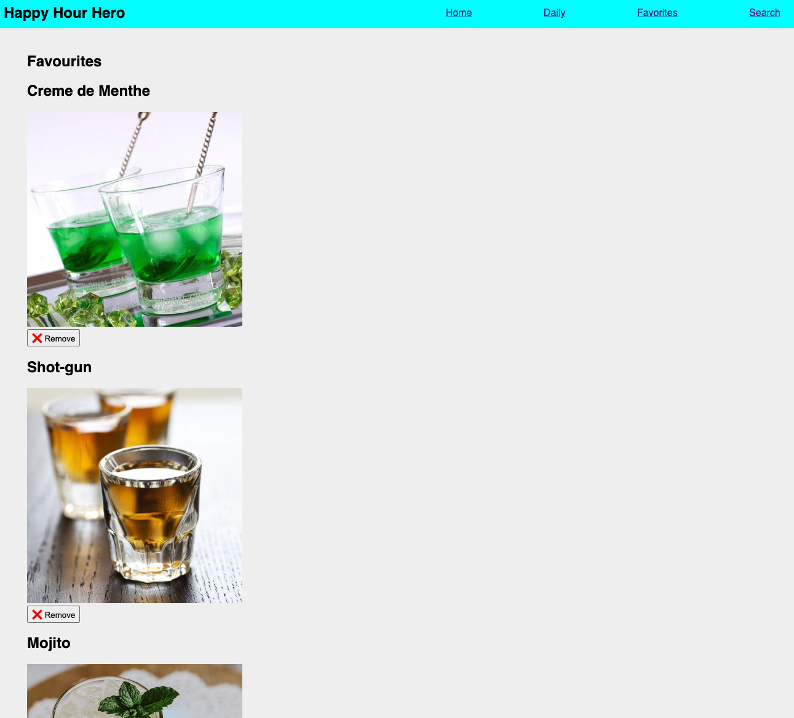
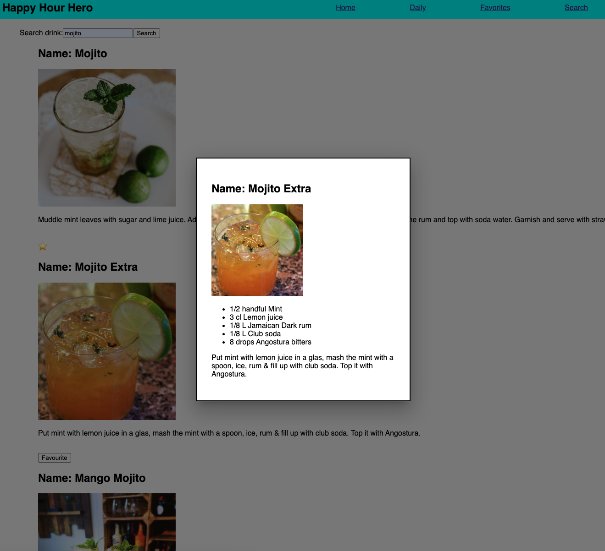
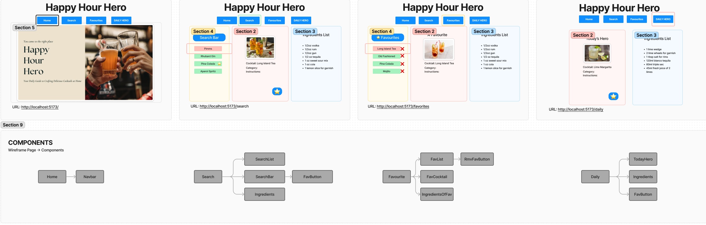
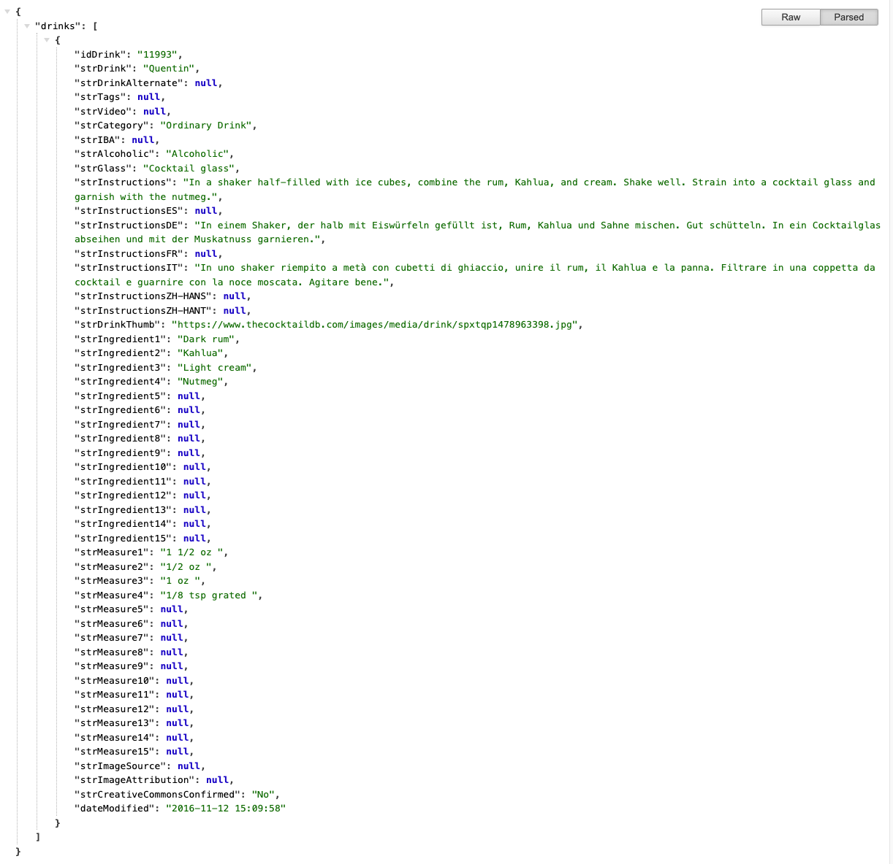
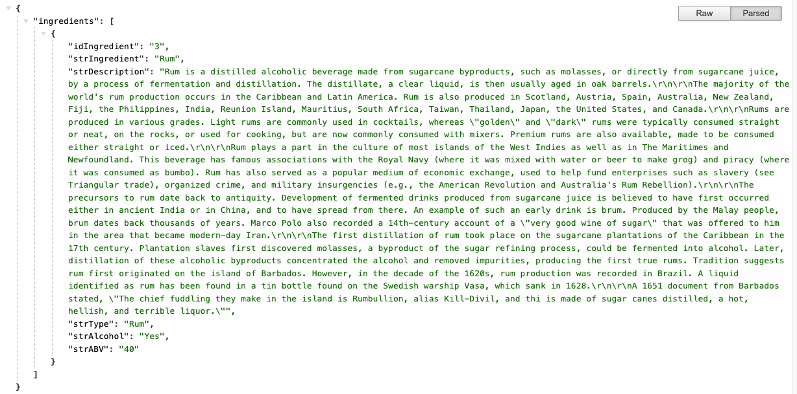
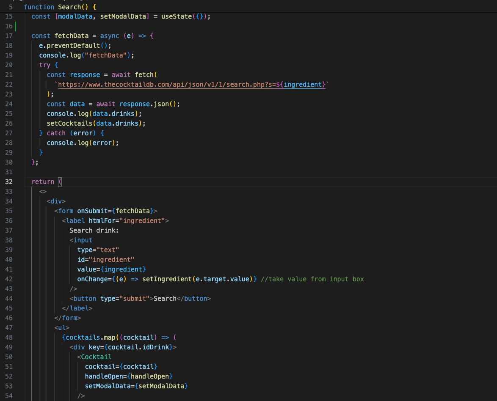
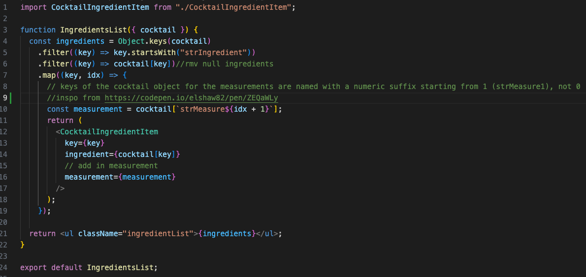
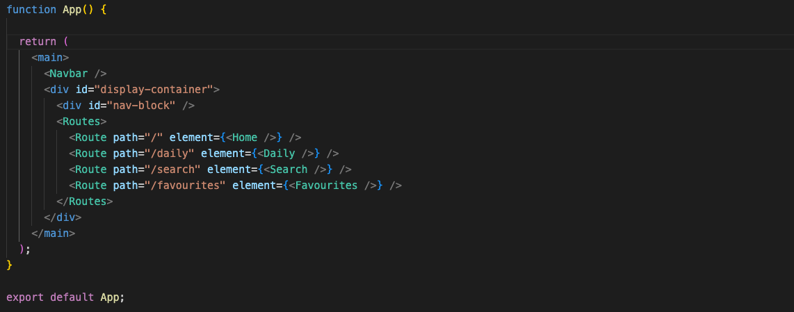
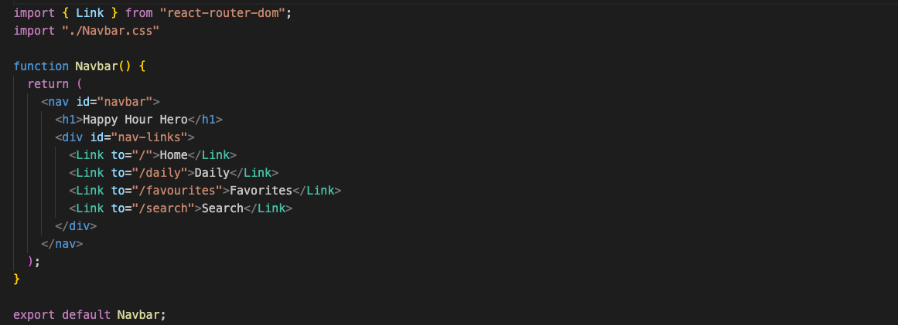
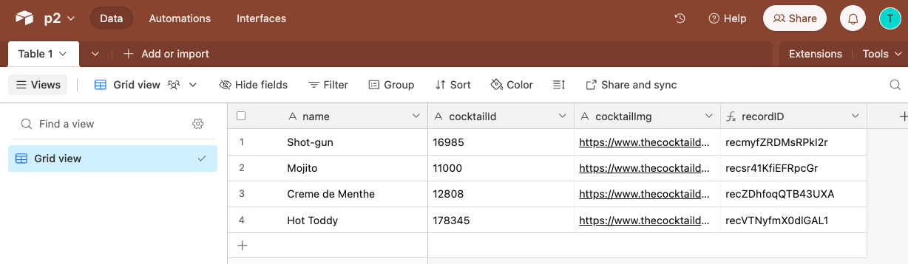

# Happy Hour Hero
The cocktail site for cocktail beginners.

## Description

Happy Hour Hero is a site for users who are interested in the world of cocktails but do not know where to start due to the sheer amount of varieties available. In this site, users can dip their toes by trying out a randomly generated cocktail on Happy Hour Hero where ingredients and instructions are provided. 

If the user enjoyed the cocktail, they could Favourite it and be able to revisit the cocktail recipe under the Favourites tab. If users change their mind about a drink added to Favourites, they would be able to remove it too. 

Furthermore, users would also be able to search up cocktails by name or ingredient and they would be able to pick from a list of cocktails relevant to their search. They would also be able to add cocktails to the Favourite list from the Search tab. However, once added to Favourites, users cannot favourite it a second time. 

Overtime, users end up with a list of cocktails of their liking!

## Getting Started

### Screenshots

- Random cocktail


- Favourite list


- Search page


### Try it for yourself

[Discover cocktails at Happy Hour Hero](https://happyhourhero.vercel.app/)

## Planning

### Project Time Frame
1.5 weeks

### IceBox, Current / MVP, Completed
[Trello Board](https://trello.com/b/fcRCbQos/my-trello-board)

### WireFrame in [Figma](https://www.figma.com/file/FWtpHUGTqsCVNScHibEzm5/Project-2%3A-HappyHourHero?type=whiteboard&node-id=92%3A7732&t=jPWZCNCRfOW0UccR-1) 




## Code

### 3rd Party API

Cocktail API Site: [CocktailDB](https://www.thecocktaildb.com/api.php)

1. [Random Cocktail API](https://www.thecocktaildb.com/api/json/v1/1/random.php)



2. [Search Cocktail API](https://www.thecocktaildb.com/api/json/v1/1/search.php?i=vodka)


### Favourite API call


### Favourite React Component


### Routing Component




### CRUD with Airtable
- Airtable


- Create in Daily.jsx
```javascript
  const postAirtable = async () => {
    const url = `https://api.airtable.com/v0/appmAwZOPe64Evw3t/Table%201`;
    const dataObj = {
      fields: {
        name: cocktail.strDrink,
        cocktailId: cocktail.idDrink,
        cocktailImg: cocktail.strDrinkThumb,
      },
    };
    const options = {
      method: "POST",
      headers: {
        "Content-Type": "application/json",
        Authorization: `Bearer ${import.meta.env.VITE_AIRTABLE_API_KEY}`,
      },
      body: JSON.stringify(dataObj),
    };
    const response = await fetch(url, options);
    const postResponse = await response.json();
    console.log(postResponse);
  };
```
- Read in Favourites.jsx
```javascript
  const fetchAirtable = async () => {
    const url = `https://api.airtable.com/v0/appmAwZOPe64Evw3t/Table%201`;
    const options = {
      method: "GET",
      headers: {
        Authorization: `Bearer ${import.meta.env.VITE_AIRTABLE_API_KEY}`,
      },
    };
    const response = await fetch(url, options);
    const airtableResponse = await response.json();
    console.log(airtableResponse.records);
    setFavouritesList(airtableResponse.records);
  };

  useEffect(() => {
    fetchAirtable();
  }, []);
```
- Update in Daily.jsx
```javascript
  useEffect(() => {
    // fetch the favourited status of the current cocktail from Airtable
    const fetchFav = async () => {
      const url = `https://api.airtable.com/v0/appmAwZOPe64Evw3t/Table%201`;
      const options = {
        method: "GET",
        headers: {
          Authorization: `Bearer ${import.meta.env.VITE_AIRTABLE_API_KEY}`,
        },
      };
      const response = await fetch(url, options);
      const airtableResponse = await response.json();
      //look for cocktails with the matching id of 'cocktail' prop
      const record = airtableResponse.records.filter(
        //returns new array of matching records
        (record) => record.fields.cocktailId === cocktail.idDrink
      );
      // if more than 1 drink
      if (record.length > 0) {
        // add on another fav drink to current fav list and set its fav status to true
        setIsFavourited(true);
      }
    };
    fetchFav();
  }, [cocktail.idDrink]);
```
- Delete in Favourites.jsx
```javascript
  const rmvFav = async (recordID) => {
    const url = `https://api.airtable.com/v0/appmAwZOPe64Evw3t/Table%201/${recordID}`;
    const options = {
      method: "DELETE",
      headers: {
        "Content-Type": "application/json",
        Authorization: `Bearer ${import.meta.env.VITE_AIRTABLE_API_KEY}`,
      },
    };
    const response = await fetch(url, options);
    const airtableResponse = response.json();
    console.log(airtableResponse);
    setFavouritesList(
      //remove those with the ID that is tagged with unfavourited drink
      favouritesList.filter((item) => item.fields.recordID !== recordID)
    );
  };
```

### Biggest Challenge

Displaying ingredient measurements with the ingredients. Due to the API seperating the two values, I had to figure out a way to display both of them inline together as a single list item.


### Key Takeaways

- More familiar working with API and the different ways that I could utlise them
- I also understood the reasoning behind reusable components
- Learnt how to use the Airtable with CRUD methods
- Dipped my toes into the world of Material UI

### Technologies Used
- JS, HTML, CSS 
- React, Vite
- Material UI
- Airtable
- Vercel

### Next Steps
- Loading states
- Display more details for each cocktail
- Search function via Category

